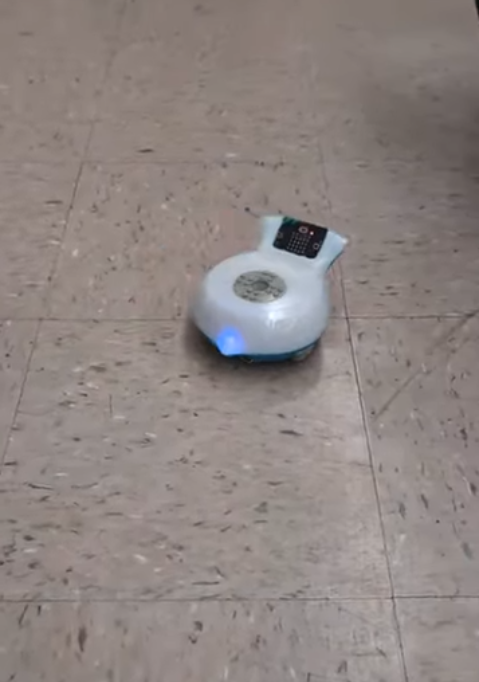

# Final Project: Finch Robot Challenges

## Essential Question
How can we apply object-oriented programming principles and Java concepts to create interactive, autonomous robot behaviors that solve real-world challenges?

## Project Overview
In this project-based learning experience, you will program a Finch 2.0 robot to perform one of three challenges:
1. Choreograph a dance routine (with movement, lights, and sound)
2. Create an artistic drawing using the robot's movements
3. Navigate a maze autonomously

Your program must demonstrate your understanding of Java programming concepts from APCSA and object-oriented design principles while creating an engaging robot behavior.

## Learning Objectives
- Apply Java programming concepts in a physical computing context
- Implement object-oriented design principles
- Develop problem-solving skills through algorithm development
- Create well-documented and maintainable code
- Practice technical communication through presentations and documentation

  ## Description of design choices
We had used a for loop for the zigzag that the bird travels in. It uses a for loop for each turn and also changing its beak color.
  ## Challenges faced and solutions
We faced some challenges when we were trying to implement playing a song through the notes onto the code. However, we were not familiar with the system that the Finch used for corressponding each note with a number. We solved this by asking our teaher for assistance and he gave us guidance on how to navigate the system. With this information, we were able to turn the song into code for our finch to play.

  ## Future enhancements
If we were to have more time, we would program the finch to move in the shape of a star to go with the twinkle twinkle little star song it plays.

  ## Video or images of your robot in action (embedded or linked)
  Video Link: https://youtube.com/shorts/qato_O08ziY?si=zrUiFhZh_5LC-m_p
  Image: 

